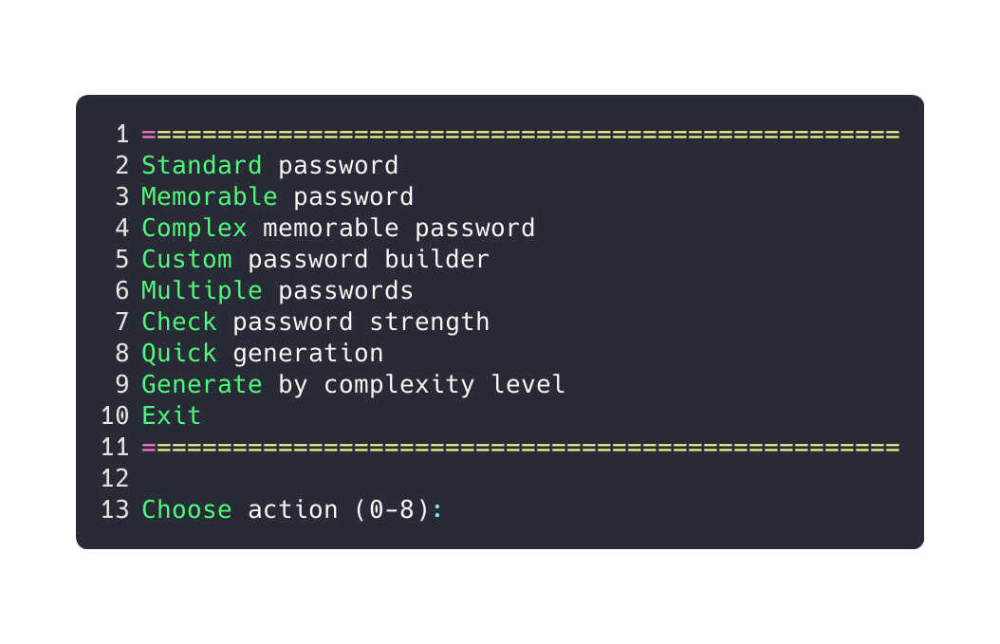

# C++ Password Generator

A flexible command-line password generator written in modern C++.  
Supports multiple generation modes with a high level of customization.

## Features

- Standard password — quick, strong, randomized password  
- Memorable password — readable, easy to remember  
- Complex memorable password — more secure, still user-friendly  
- Custom password builder — define length, character sets, patterns  
- Multiple passwords — generate many at once  
- Password strength check — basic security estimation  
- Quick generation — one-click generation  
- Generation by complexity level — pick desired strength or entropy

---

## Usage

Run the executable after building:

```bash
./password_generator
````

---

## Building from Source

Clone the repository and build the project following the instructions for your platform.

<details>
<summary><strong>Linux / macOS</strong></summary>

```bash
# Clone the repo
git clone https://github.com/rafabduloff/cpp-pswd-gen.git
cd cpp-pswd-gen

# Build with g++
g++ -std=c++17 -o password-generator main.cpp

# Run
./password-generator
```

If you have multiple source files or use CMake, update these commands accordingly.

</details>

<details>
<summary><strong>Windows (PowerShell)</strong></summary>

---

## Windows Users

If you prefer not to build from source, you can download precompiled Windows binaries (`.exe`) from the [Releases](https://github.com/rafabduloff/cpp-pswd-gen/releases) page.
Just download the latest release, unzip if needed, and run the executable directly.

---

```powershell
# Clone the repo
git clone git@github.com:rafabduloff/cpp-pswd-gen.git
cd cpp-pswd-gen

# Build with MSVC (Visual Studio Developer Command Prompt)
cl /EHsc /std:c++17 main.cpp /Fe:password_generator.exe

# Run
.\password_generator.exe
```

Alternatively, you can build with MinGW's g++ if installed:

```powershell
g++ -std=c++17 -o password_generator.exe main.cpp
.\password_generator.exe
```

</details>

---

## Screenshot



---
